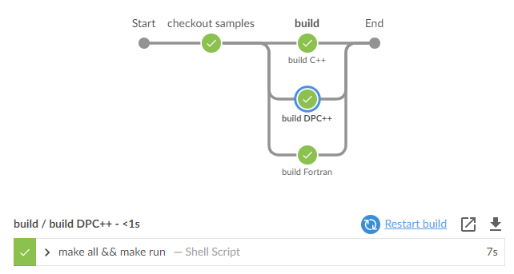

.. SPDX-FileCopyrightText: 2020 Intel Corporation
..
.. SPDX-License-Identifier: CC-BY-4.0

============================
Intel\ |r| oneAPI CI Samples
============================

.. image:: https://api.reuse.software/badge/github.com/oneapi-src/oneapi-ci
   :target: https://api.reuse.software/info/github.com/oneapi-src/oneapi-ci
   :alt: REUSE status

This repo contains sample Public/Cloud CI configurations that
demonstrate installing Intel\ |r| oneAPI toolkit components and building
applications:

===============  ===========================================
Compilers        icc, ifort, dpcpp
OS platforms     Linux, Windows, MacOS
Install methods  Intel\ |r| installer, apt, dnf, docker container
===============  ===========================================

The config files show examples of all supported configurations. Delete
the ones you do not want.

For a complete list of components available for installation,
see |ListComponentsStatus|.

Status
======

==================  ==================================  ================
CI                  Config                              Status
==================  ==================================  ================
GitHub Actions      `.github/workflows/build_all.yml`_  |GitHubStatus|
Circle CI           `.circleci/config.yml`_             |CircleStatus|
AppVeyor            `.appveyor.yml`_                    |AppVeyorStatus|
GitLab CI           `.gitlab-ci.yml`_                   |GitLabStatus|
Azure Pipelines     `.azure-pipelines.yml`_             |AzureStatus|
==================  ==================================  ================

Supported Configurations
========================

======== ========= ========= ============ ===== ======= ===========
\        C++/Fortran/DPC++                              C++/Fortran
-------- ---------------------------------------------- -----------
CI       Linux APT Linux DNF Linux Docker Linux Windows MacOS
======== ========= ========= ============ ===== ======= ===========
GitHub   |c|       |c|       |c|          |c|   |c|     |c|
Circle   |c|       |c|       |c|          |c|   |c|     |x|
AppVeyor |c|       |x|       |x|          |c|   |c|     |c|
GitLab   |c|       |c|       |x|          |c|   |c|     |x|
Azure    |c|       |c|       |c|          |c|   |c|     |c|
Jenkins  |x|       |x|       |c|          |x|   |x|     |x|
======== ========= ========= ============ ===== ======= ===========

Using oneAPI in Jenkins pipelines
=================================

There are multiple ways to add oneAPI tools to a Jenkins pipeline:

#. setup the tools on Jenkins agent directly, or create custom
   container with the tools you need

    * refer to `Intel® oneAPI Toolkits Installation Guides`_ for
      details
    * explore installation scripts in this repo for examples
#. use optimized containers from `Intel oneContainer Portal`_

The Jenkinsfile in this repo demonstrates building DPC++, C++ and
Fortran samples in intel/oneapi-hpckit container in Jenkins.

To give it a try:

#. Follow `Jenkins Install Guide`_ to setup Jenkins, or use your
   existing setup.
#. Install Docker and Docker Pipeline plugins.
#. Create new pipeline for this repository using
   New Item -> Pipeline.
#. Build the pipeline.
#. The result will look like this in Blue Ocean.

|Jenkins Pipeline Example|

Troubleshooting
===============

The repo contains scripts that can be used in CI configurations to
collect detailed installation logs in case of installation
issues. Replace calls to "install" scripts with calls to
"install_debug" or "install_debug_hang" scripts to use this
functionality.

License
=======

See licenses_

Contribute
==========

See contributing_.

Security
========

See `security guidelines`_.

.. _licenses: LICENSES
.. _contributing: CONTRIBUTING.rst
.. _`security guidelines`: https://www.intel.com/content/www/us/en/security-center/default.html
.. _`Intel® oneAPI Toolkits Installation Guides`: https://software.intel.com/content/www/us/en/develop/articles/installation-guide-for-intel-oneapi-toolkits.html
.. _`Jenkins Install Guide`: https://www.jenkins.io/doc/book/installing/
.. _`Intel oneContainer Portal`: https://software.intel.com/content/www/us/en/develop/tools/containers/get-started.html

.. _`.travis.yml`: .travis.yml
.. _`.circleci/config.yml`: .circleci/config.yml
.. _`.appveyor.yml`: .appveyor.yml
.. _`.gitlab-ci.yml`: .gitlab-ci.yml
.. _`.github/workflows/build_all.yml`: .github/workflows/build_all.yml
.. _`.azure-pipelines.yml`: .azure-pipelines.yml

.. |GitHubStatus| image:: https://github.com/mmzakhar/oneapi-ci/workflows/build_all/badge.svg
   :target: https://github.com/mmzakhar/oneapi-ci/actions?query=workflow%3Abuild_all
   :alt: Build status
.. |CircleStatus| image:: https://circleci.com/gh/mmzakhar/oneapi-ci/tree/master.svg
   :target: https://circleci.com/gh/mmzakhar/oneapi-ci/tree/master
   :alt: Build status
.. |AppVeyorStatus| image:: https://ci.appveyor.com/api/projects/status/y06fiwtls22x7475?svg=true
   :target: https://ci.appveyor.com/project/mmzakhar/oneapi-ci
   :alt: Build status
.. |GitLabStatus| image:: https://gitlab.com/mmzakhar/oneapi-ci/badges/master/pipeline.svg
   :target: https://gitlab.com/mmzakhar/oneapi-ci/-/commits/master
   :alt: Build status
.. |AzureStatus| image:: https://dev.azure.com/maximmzakharov/oneapi-ci/_apis/build/status/mmzakhar.oneapi-ci?branchName=master
   :target: https://dev.azure.com/maximmzakharov/oneapi-ci/_build
   :alt: Build status
.. |ListComponentsStatus| image:: https://github.com/mmzakhar/oneapi-ci/workflows/list_components/badge.svg
   :target: https://github.com/mmzakhar/oneapi-ci/actions?query=workflow%3Alist_components
   :alt: Build status

.. |r| unicode:: U+000AE
.. |c| unicode:: U+2714
.. |x| unicode:: U+2717
